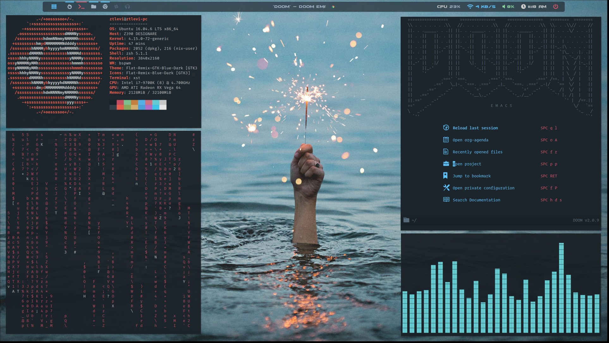

# dotty - Scalable dotfiles manager

Dotty with your dotfiles? Try dotty, a scalable dotfiles manager for linux and macos.

This repo is forked from
[Hlissner's dotfiles](https://github.com/hlissner/dotfiles/tree/b89a56f310df841c805a8b0ce032f1a31c134173).

Dotty is tested on Ubuntu, Arch, AmazonLinux 2 and MacOS!

## Video tutorial

Follow my channel's tutorial if you like:

| Youtube                                                                                                                            | Bilibili                                                                                                                                          |
| ---------------------------------------------------------------------------------------------------------------------------------- | ------------------------------------------------------------------------------------------------------------------------------------------------- |
| [](https://www.youtube.com/watch?v=p62CaVeXy58&list=PL4uJniLtmhUOXtemnVzV_gSTft9MnApdo) | [](https://space.bilibili.com/6856413/channel/seriesdetail?sid=521607&ctype=0) |

## Quick start

> Note: if you're in China. Use the homebrew mirror
> https://mirrors.tuna.tsinghua.edu.cn/help/homebrew/

```sh
bash <(curl -s https://raw.githubusercontent.com/ztlevi/dotty/main/bootstrap.sh)
```

This script will install homebrew, zsh and clone this dotty repo.

> Note: You can also fork this repo. After fork, update your bootstrap.sh script with your git url.
> Then you can add your personal customization.



## Install

```sh
cd ~/.config/dotty

# gh credentials are used by git
gh auth login

# (SKIP THIS) Initialize my personal assets submodule. Only me has the private repo access
# Cannot clone private submodules with password. Maybe it's due to two-factor auth is enabled.
# Authenticate with gh solves this issue.
# git clone https://github.com/ztlevi/dotty-assets.git assets

# (REQUIRED) Minimal setup, and start a new shell, afterwards, you can use `dotty` instead `./deploy`
./deploy base/macos # MacOS
./deploy base/linux # Debian, Arch or RHEL
./deploy shell/zsh shell/git && zsh
# (IMPORTANT) Setup local git confing following this README
# https://github.com/ztlevi/dotty/blob/main/shell/git/README.md

# Linux Desktop Environment (Gnome/Bspwm)
dotty wm/gnome

# Shell
dotty shell/alacritty shell/tmux shell/ranger \
  shell/fzf shell/aspell shell/work
# Editor
dotty editor/emacs editor/neovim editor/editorconfig editor/vscode
# Development
dotty dev/cc dev/go dev/latex dev/node dev/python dev/java
# Misc
dotty misc/docker misc/gpg misc/cspell misc/apps

# (OPTIONAL) private apps. Do not install on company machines.
# dotty misc/private
```

## Post-Installation

### (Optional) For GPG

1. Don't forget to import your private/public GPG keys. If you're interested in GPG forwarding over
   ssh, see [README](./misc/gpg/README.md).
2. On Linux, you will need to init `pass` to enable Git-Credential-Manager-Core (GCM-Core),
   `pass init <your-gpg-email>`. If you select **personal access token**, go
   [here](https://github.com/settings/tokens) to create a new token.

## Update

Check out my `update_dotty` function
[update_dotty](https://github.com/ztlevi/dotty-config/blob/0057fb82c5fac057ccbc368dce191c140864f86d/shell/zsh/utils.zsh#L97).
Most of the time, I can simply run `update_dotty`. If you have something new to install and
uninstall things, you can put the scripts in
[here](https://github.com/ztlevi/dotty/blob/main/legacy_sync_script.zsh). Typically I use force
option, e.g. `berw install -f` to perform the operation even if it's already uninstalled or
installed to avoid any blocking, when you try running `update_dotty` multiple times.

## Overview

```sh
# general
bin/       # global scripts
fonts/     # user fonts
assets/    # wallpapers, sounds, screenshots, etc
wm/        # linux window manager environments
desktop/   # linux desktop apps

# categories
base/      # provisions my system with the bare essentials
dev/       # relevant to software development & programming in general
editor/    # configuration for my text editors
misc/      # for various apps & tools
shell/     # shell utilities, including zsh + bash
```

## Dotty command line options

```sh
Usage: dotty [-acdlLit] [TOPIC...]

  -a   Target all enabled topics (ignores TOPIC args)
  -c   Afterwards, remove dead symlinks & empty dot-directories in $HOME.
       Can be used alone.
  -d   Unlink and run `./_init clean` for topic(s)
  -l   Only relink topic(s) (implies -i)
  -L   List enabled topics
  -i   Inhibit install/update/clean init scripts
  -t   Do a test run; do not actually do anything
```

e.g.

- `dotty base/arch shell/{zsh,tmux}`: enables base/arch, shell/zsh & shell/tmux
- `dotty -d shell/zsh`: disables shell/zsh & cleans up after it
- `dotty -l shell/zsh`: refresh links for shell/zsh (inhibits init script)
- `dotty -l`: relink all enabled topics
- `dotty -r`: reinstall the topic(s)
- `dotty -L`: list all enabled topics

Here's a breakdown of what the script does:

```sh
cd $topic
if [[ -L $DOTTY_DATA_HOME/${topic//\//.}.topic ]]; then
    ./_init update
else
    ln -sfv $DOTTY_CONFIG_HOME/$topic $DOTTY_DATA_HOME/${topic//\//.}.topic

    source $DOTTY_CONFIG_HOME/$topic/env.zsh
    ./_init install
    ./_init link
fi
```

## FAQ

- Why I cannot do git commit?
  - Make sure you create your GPG key or delete `user.signingkey` property in
    `$HOME/.config/git/config`.
- What if I have some local zsh configuration?
  - You can `dotty shell/work`, and put things under `$HOME/work/dots/env.zsh` or
    `$HOME/work/dots/aliases.zsh`
- I installed npm packages globally but it not showed up in `$HOME/.local/share/nodenv/shims` path.
  It could also happens for pyenv and others.
  - The simplest way is run `envrehash` in shell. Under the sceens, it's running commands like
    `nodenv rehash` to generate bin files.
- I want to use dark theme, what changes should I make?
  - Change LS_COLORS in `~/.config/dotty/config/shell/alacritty/vivid.zsh`.
  - Change the theme_file
    [here](https://github.com/ztlevi/dotty/blob/master/shell/alacritty/_init#L55).
  - Change tmux theme option
    [here](https://github.com/ztlevi/dotty-config/blob/main/shell/tmux/tmux.conf#L49) to `dark`.
- I'm running the bootstrap script on AWS EC2 instance, but I don't know the password.
  - AWS EC2 instance doesn't come with password. Change it with for example `sudo passwd $(whoami)`
- How do I sync between different machines?
  - Unfortunately, there is no such easy way. For me, I put down install/uninstall scripts in
    `dotty/legacy_sync_script.zsh` and every time I run
    [update_my_repos](https://github.com/ztlevi/dotty/blob/master/shell/zsh/utils.zsh#L132) aliased
    as `uu`, it will run the `legacy_sync_script.zsh`. NixOS has such ability to resolve what have
    changed in your configuration and able to install and uninstall software and make sure they are
    consistent across machines. If you're interested, you can try my
    [dotty-nix](https://github.com/ztlevi/dotty-nix).

## Relevant projects

- [DOOM Emacs](https://github.com/ztlevi/doom-config) (pulled by `editor/emacs`)
- My vim config (pulled by `editor/neovim`)
